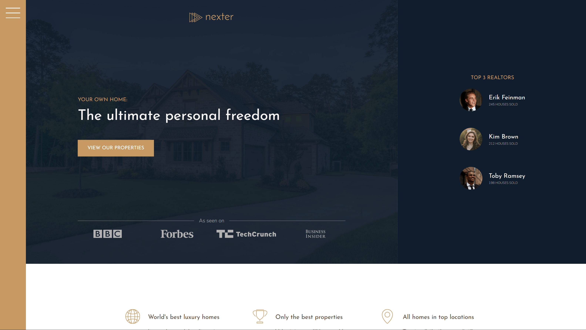

# 🏡 Nexter

A responsive real estate landing page featuring a grid-based layout, CSS-only interactivity, and elegant UI composition. Designed to showcase modern CSS techniques with semantic HTML and SCSS architecture.

**🔗 Live Demo**: [Nexter](https://dobbyssockk.github.io/nexter/)

---

## 🧭 Project Overview

**Nexter** is a static front-end layout simulating a high-end real estate service. It features a complex grid structure, custom cards for properties, and CSS-only UI components such as buttons, badges, and layout patterns — all crafted using SCSS modules and BEM naming.

---

## 🚀 Features

- Fully responsive, grid-based layout
- Clean and semantic structure using modern HTML5
- Featured property cards with image, price, and owner avatars
- Minimal sidebar navigation concept
- Realtor highlights

---

## 🛠️ Technologies Used

- **HTML5** – semantic, accessible structure
- **CSS3** – custom grid, transitions, utility classes
- **SCSS** – modular structure with variables, mixins, partials
- **BEM methodology** – for organized and reusable class naming
- **Google Fonts** – Josefin Sans, Nunito for a modern look

---

## 💡 Key Concepts

- **CSS Grid layout**: custom column/row spans and named areas
- **Modular SCSS architecture**: partials split into layout, base, components
- **Visual hierarchy**: carefully managed spacing and typography
